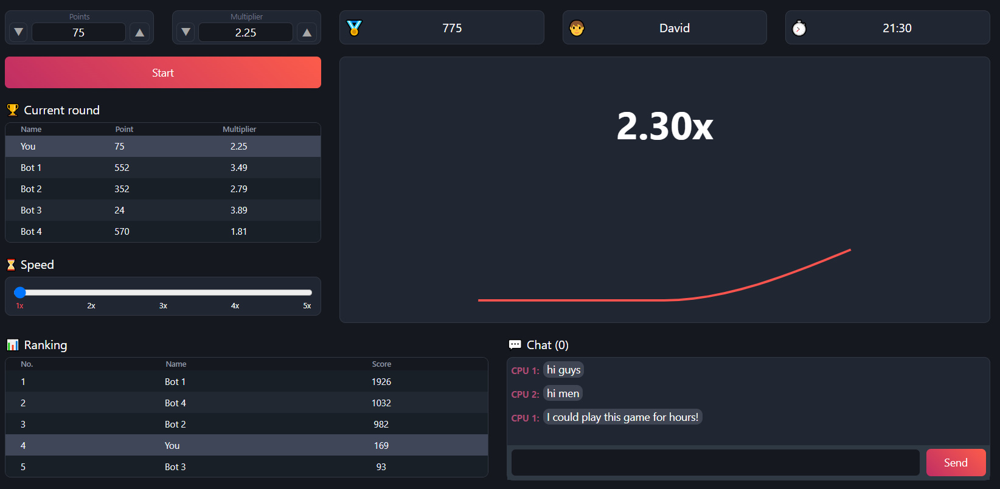

# Guess The Number Assessment

This is a guessing game based on random numbers and will progress through a series of rounds. The goal of this game is to observe the rising Multiplier value, predict at which point it will freeze, and place points based on the prediction.

## Features

- Livetime chat
- Ranking system
- Render graph with configurable speed
- Possibility to choose the point and multiplier for the round

### Built With

- TypeScript
- React.js
- Redux
- Node.js
- Socket.io
- Bootstrap CSS
- Jest
- ESLint

## Demo



> Preview screenshot

## Getting Started

To get a local copy up and running follow these simple steps.

### Installation

1. Clone the repo
   ```sh
   git clone https://github.com/favrora/Splash-Task.git
   ```
2. From the root, install NPM packages
   ```sh
   npm install
   ```
3. Start the server:
   ```sh
   npm run server
   ```
4. In the second console, start the frontend:
   ```sh
   npm run start
   ```
