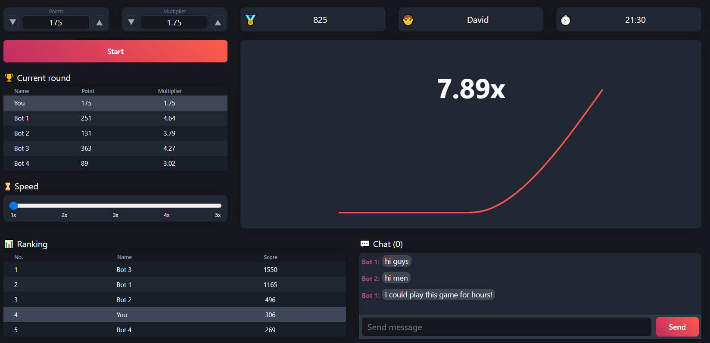

# Multiplier Arena

[](https://github.com/favrora/Guessing-Game/actions/workflows/ci.yml)

A real-time multiplayer prediction game built around short multiplier rounds. Players choose a stake and target multiplier, compete with simulated opponents, and chat through a Socket.IO channel.



## Highlights

- Responsive React 19 interface with an animated multiplier chart
- Predictable round settlement with guarded balance updates
- Real-time chat and online-presence updates over Socket.IO
- Typed Redux Toolkit state and isolated game hooks
- Input validation on both client and server boundaries
- Vitest component tests, ESLint checks, and GitHub Actions CI

## Stack

`React 19` · `TypeScript` · `Vite 8` · `Redux Toolkit` · `Socket.IO` · `Express` · `Recharts` · `Vitest`

## Architecture

```text
src/
├── components/     Focused dashboard and game UI
├── controllers/    Socket.IO server event handlers
├── hooks/          Round, opponent, and chat behavior
├── services/       Client socket boundary
├── store/          Typed Redux state and actions
└── utils/          Deterministic utility boundaries
```

The Vite development server proxies Socket.IO traffic to the local Express server. In production, Express serves the compiled client and the socket endpoint from one origin.

## Run Locally

Requirements: Node.js 22.12 or newer.

```bash
npm install
npm run server
```

In a second terminal:

```bash
npm run dev
```

Open `http://localhost:5173`.

## Quality Checks

```bash
npm run check
```

This runs linting, tests, TypeScript validation, and the production build. The same command runs in CI for every pull request and push to `master`.

## Configuration

The client uses the current origin by default. To connect to a separate Socket.IO server, set:

```dotenv
VITE_SOCKET_URL=https://your-socket-host.example
```
